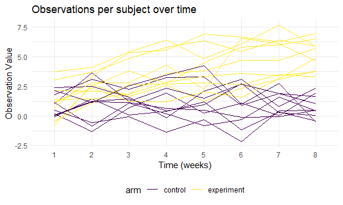

Homework 5
================
Kailey Rishovd
11/87/2020

``` r
library(tidyverse)
```

    ## -- Attaching packages ------------------------------------ tidyverse 1.3.0 --

    ## v ggplot2 3.3.2     v purrr   0.3.4
    ## v tibble  3.0.3     v dplyr   1.0.2
    ## v tidyr   1.1.2     v stringr 1.4.0
    ## v readr   1.3.1     v forcats 0.5.0

    ## -- Conflicts --------------------------------------- tidyverse_conflicts() --
    ## x dplyr::filter() masks stats::filter()
    ## x dplyr::lag()    masks stats::lag()

``` r
library(rvest)
```

    ## Loading required package: xml2

    ## 
    ## Attaching package: 'rvest'

    ## The following object is masked from 'package:purrr':
    ## 
    ##     pluck

    ## The following object is masked from 'package:readr':
    ## 
    ##     guess_encoding

``` r
knitr::opts_chunk$set(
  fig.width = 6, 
  fig.asp = .6, 
  out.width = "90%"
)
theme_set(theme_minimal() + theme(legend.position = "bottom"))
options(
  ggplot.continuous.colour = "viridis", 
  ggplot.continuous.fill = "viridis"
)
scale_colour_discrete = scale_colour_viridis_d
scale_fill_discrete = scale_fill_viridis_d

set.seed(1)
```

## Problem 1

Read in the data.

#### Data Description:

The homicide data provided by the Washington Post is information on over
52,000 criminal homicides in 50 large U.S. cities over the past decade.
It contains variables that describe the date and location of the
killing, if there was an arrest made (or not), basic demographics about
the victim (first and last name, race, age, sex).

``` r
homicide_df = 
  read_csv("data/homicide-data.csv") %>% 
  mutate(
    city_state = str_c(city, state, sep = "_"), 
    resolved = case_when(
      disposition == "Closed without arrest" ~ "unsolved", 
      disposition == "Open/No arrest"        ~ "unsolved", 
      disposition == "Closed by arrest"      ~ "solved",
      )
  ) %>% 
  select(city_state, resolved) %>% 
  filter(city_state != "Tulsa_AL")
```

    ## Parsed with column specification:
    ## cols(
    ##   uid = col_character(),
    ##   reported_date = col_double(),
    ##   victim_last = col_character(),
    ##   victim_first = col_character(),
    ##   victim_race = col_character(),
    ##   victim_age = col_character(),
    ##   victim_sex = col_character(),
    ##   city = col_character(),
    ##   state = col_character(),
    ##   lat = col_double(),
    ##   lon = col_double(),
    ##   disposition = col_character()
    ## )

Take a closer look….

``` r
aggregate_df = 
  homicide_df %>%
    group_by(city_state) %>% 
    summarize(
      hom_total = n(), 
      hom_unsolved = sum(resolved == "unsolved")
    )
```

    ## `summarise()` ungrouping output (override with `.groups` argument)

Single city prop test…

``` r
prop.test(
  aggregate_df %>% filter(city_state == "Baltimore_MD") %>%  pull(hom_unsolved), 
  aggregate_df %>% filter(city_state == "Baltimore_MD") %>% pull(hom_total)) %>% 
  broom::tidy()
```

    ## # A tibble: 1 x 8
    ##   estimate statistic  p.value parameter conf.low conf.high method    alternative
    ##      <dbl>     <dbl>    <dbl>     <int>    <dbl>     <dbl> <chr>     <chr>      
    ## 1    0.646      239. 6.46e-54         1    0.628     0.663 1-sample~ two.sided

Iterate…

``` r
results_df =
  aggregate_df %>% 
    mutate(
      prop_tests = map2(.x = hom_unsolved, .y = hom_total, ~prop.test(x = .x, n = .y)), 
      tidy_tests = map(.x = prop_tests, ~broom::tidy(.x))
    ) %>% 
    select(-prop_tests) %>% 
    unnest(tidy_tests) %>% 
    select(city_state, estimate, conf.low, conf.high)
```

Plot estimates and CIs for each city…. organized by proportion of
unsolved homicides…

``` r
results_df %>% 
  mutate(
    city_state = fct_reorder(city_state, estimate)
  ) %>% 
  ggplot(aes(x = city_state, y = estimate)) + 
  geom_point() + 
  geom_errorbar(aes(ymin = conf.low, ymax = conf.high)) + 
  theme(axis.text.x = element_text(angle = 90, vjust = 0.5, hjust = 1))
```


## Problem 2

Import data and tidy

``` r
path_df = 
  tibble(
    path = list.files("data/lda_data"), 
  ) %>% 
    mutate(
      path = str_c("data/lda_data/", path), 
      data = map(path, read_csv)) %>%
  unnest(data) %>% 
  pivot_longer(
    week_1:week_8, 
    names_to = "week", 
    values_to = "observation", 
    names_prefix = "week_"
  ) %>%
  mutate(
    week = as.factor(week)
  ) %>% 
  separate(path, c("path", "arm_id"), sep = "lda_data/") %>% 
  separate(arm_id, c("arm", "id"), sep = "_") %>% 
  separate(id, c("id", "csv")) %>% 
  select(id, arm, week, observation) %>% 
  mutate(
    arm = str_replace(arm, c("con"), "control"), 
    arm = str_replace(arm, c("exp"), "experiment")
  )
```

    ## Parsed with column specification:
    ## cols(
    ##   week_1 = col_double(),
    ##   week_2 = col_double(),
    ##   week_3 = col_double(),
    ##   week_4 = col_double(),
    ##   week_5 = col_double(),
    ##   week_6 = col_double(),
    ##   week_7 = col_double(),
    ##   week_8 = col_double()
    ## )
    ## Parsed with column specification:
    ## cols(
    ##   week_1 = col_double(),
    ##   week_2 = col_double(),
    ##   week_3 = col_double(),
    ##   week_4 = col_double(),
    ##   week_5 = col_double(),
    ##   week_6 = col_double(),
    ##   week_7 = col_double(),
    ##   week_8 = col_double()
    ## )
    ## Parsed with column specification:
    ## cols(
    ##   week_1 = col_double(),
    ##   week_2 = col_double(),
    ##   week_3 = col_double(),
    ##   week_4 = col_double(),
    ##   week_5 = col_double(),
    ##   week_6 = col_double(),
    ##   week_7 = col_double(),
    ##   week_8 = col_double()
    ## )
    ## Parsed with column specification:
    ## cols(
    ##   week_1 = col_double(),
    ##   week_2 = col_double(),
    ##   week_3 = col_double(),
    ##   week_4 = col_double(),
    ##   week_5 = col_double(),
    ##   week_6 = col_double(),
    ##   week_7 = col_double(),
    ##   week_8 = col_double()
    ## )
    ## Parsed with column specification:
    ## cols(
    ##   week_1 = col_double(),
    ##   week_2 = col_double(),
    ##   week_3 = col_double(),
    ##   week_4 = col_double(),
    ##   week_5 = col_double(),
    ##   week_6 = col_double(),
    ##   week_7 = col_double(),
    ##   week_8 = col_double()
    ## )
    ## Parsed with column specification:
    ## cols(
    ##   week_1 = col_double(),
    ##   week_2 = col_double(),
    ##   week_3 = col_double(),
    ##   week_4 = col_double(),
    ##   week_5 = col_double(),
    ##   week_6 = col_double(),
    ##   week_7 = col_double(),
    ##   week_8 = col_double()
    ## )
    ## Parsed with column specification:
    ## cols(
    ##   week_1 = col_double(),
    ##   week_2 = col_double(),
    ##   week_3 = col_double(),
    ##   week_4 = col_double(),
    ##   week_5 = col_double(),
    ##   week_6 = col_double(),
    ##   week_7 = col_double(),
    ##   week_8 = col_double()
    ## )
    ## Parsed with column specification:
    ## cols(
    ##   week_1 = col_double(),
    ##   week_2 = col_double(),
    ##   week_3 = col_double(),
    ##   week_4 = col_double(),
    ##   week_5 = col_double(),
    ##   week_6 = col_double(),
    ##   week_7 = col_double(),
    ##   week_8 = col_double()
    ## )
    ## Parsed with column specification:
    ## cols(
    ##   week_1 = col_double(),
    ##   week_2 = col_double(),
    ##   week_3 = col_double(),
    ##   week_4 = col_double(),
    ##   week_5 = col_double(),
    ##   week_6 = col_double(),
    ##   week_7 = col_double(),
    ##   week_8 = col_double()
    ## )
    ## Parsed with column specification:
    ## cols(
    ##   week_1 = col_double(),
    ##   week_2 = col_double(),
    ##   week_3 = col_double(),
    ##   week_4 = col_double(),
    ##   week_5 = col_double(),
    ##   week_6 = col_double(),
    ##   week_7 = col_double(),
    ##   week_8 = col_double()
    ## )
    ## Parsed with column specification:
    ## cols(
    ##   week_1 = col_double(),
    ##   week_2 = col_double(),
    ##   week_3 = col_double(),
    ##   week_4 = col_double(),
    ##   week_5 = col_double(),
    ##   week_6 = col_double(),
    ##   week_7 = col_double(),
    ##   week_8 = col_double()
    ## )
    ## Parsed with column specification:
    ## cols(
    ##   week_1 = col_double(),
    ##   week_2 = col_double(),
    ##   week_3 = col_double(),
    ##   week_4 = col_double(),
    ##   week_5 = col_double(),
    ##   week_6 = col_double(),
    ##   week_7 = col_double(),
    ##   week_8 = col_double()
    ## )
    ## Parsed with column specification:
    ## cols(
    ##   week_1 = col_double(),
    ##   week_2 = col_double(),
    ##   week_3 = col_double(),
    ##   week_4 = col_double(),
    ##   week_5 = col_double(),
    ##   week_6 = col_double(),
    ##   week_7 = col_double(),
    ##   week_8 = col_double()
    ## )
    ## Parsed with column specification:
    ## cols(
    ##   week_1 = col_double(),
    ##   week_2 = col_double(),
    ##   week_3 = col_double(),
    ##   week_4 = col_double(),
    ##   week_5 = col_double(),
    ##   week_6 = col_double(),
    ##   week_7 = col_double(),
    ##   week_8 = col_double()
    ## )
    ## Parsed with column specification:
    ## cols(
    ##   week_1 = col_double(),
    ##   week_2 = col_double(),
    ##   week_3 = col_double(),
    ##   week_4 = col_double(),
    ##   week_5 = col_double(),
    ##   week_6 = col_double(),
    ##   week_7 = col_double(),
    ##   week_8 = col_double()
    ## )
    ## Parsed with column specification:
    ## cols(
    ##   week_1 = col_double(),
    ##   week_2 = col_double(),
    ##   week_3 = col_double(),
    ##   week_4 = col_double(),
    ##   week_5 = col_double(),
    ##   week_6 = col_double(),
    ##   week_7 = col_double(),
    ##   week_8 = col_double()
    ## )
    ## Parsed with column specification:
    ## cols(
    ##   week_1 = col_double(),
    ##   week_2 = col_double(),
    ##   week_3 = col_double(),
    ##   week_4 = col_double(),
    ##   week_5 = col_double(),
    ##   week_6 = col_double(),
    ##   week_7 = col_double(),
    ##   week_8 = col_double()
    ## )
    ## Parsed with column specification:
    ## cols(
    ##   week_1 = col_double(),
    ##   week_2 = col_double(),
    ##   week_3 = col_double(),
    ##   week_4 = col_double(),
    ##   week_5 = col_double(),
    ##   week_6 = col_double(),
    ##   week_7 = col_double(),
    ##   week_8 = col_double()
    ## )
    ## Parsed with column specification:
    ## cols(
    ##   week_1 = col_double(),
    ##   week_2 = col_double(),
    ##   week_3 = col_double(),
    ##   week_4 = col_double(),
    ##   week_5 = col_double(),
    ##   week_6 = col_double(),
    ##   week_7 = col_double(),
    ##   week_8 = col_double()
    ## )
    ## Parsed with column specification:
    ## cols(
    ##   week_1 = col_double(),
    ##   week_2 = col_double(),
    ##   week_3 = col_double(),
    ##   week_4 = col_double(),
    ##   week_5 = col_double(),
    ##   week_6 = col_double(),
    ##   week_7 = col_double(),
    ##   week_8 = col_double()
    ## )

Spaghetti plot showing observations on each subject over time

``` r
path_df %>% 
  mutate(
    regrouped = str_c(id, arm, sep = "_")
  ) %>% 
  ggplot(aes(x = week, y = observation, group = regrouped, color = arm)) +
  geom_line() +
  labs(title = "Observations per subject over time") +
  xlab("Time (weeks)") + 
  ylab("Observation Value")
```



Graph description HERE once figured out

## Problem 3

Create function

``` r
sim_one_samp = function(n = 30, mu = 0, sigma = 5) { 
  
  sim_data = tibble(
    x = rnorm(n, mean = mu, sd = sigma),
  )
  
  sim_data %>% 
    t.test(mu = 0, conf.level = 0.95) %>% 
    broom::tidy() %>% 
    select(estimate, p.value)
  
}
```

Repeat sim for mu = 1:6

``` r
sim_results = 
  tibble(
    mu = c(0, 1, 2, 3, 4, 5, 6)
  ) %>% 
  mutate(
    output_lists = map(.x = mu, ~rerun(5000, sim_one_samp(mu = .x))), 
    estimate_df = map(output_lists, bind_rows)
    ) %>% 
    select(-output_lists) %>% 
    unnest(estimate_df) %>% 
  mutate(
    reject = case_when(
      p.value <= 0.05 ~ "reject", 
      p.value > 0.05 ~ "FTR"
    )
  )
```

Let’s make some plots from this simulation…

To look at the proportion of times the null was rejected (power)
vs. true value of mu

``` r
sim_results %>% 
  group_by(mu) %>% 
  count(reject)
```

    ## # A tibble: 12 x 3
    ## # Groups:   mu [7]
    ##       mu reject     n
    ##    <dbl> <chr>  <int>
    ##  1     0 FTR     4746
    ##  2     0 reject   254
    ##  3     1 FTR     4055
    ##  4     1 reject   945
    ##  5     2 FTR     2158
    ##  6     2 reject  2842
    ##  7     3 FTR      564
    ##  8     3 reject  4436
    ##  9     4 FTR       41
    ## 10     4 reject  4959
    ## 11     5 reject  5000
    ## 12     6 reject  5000
